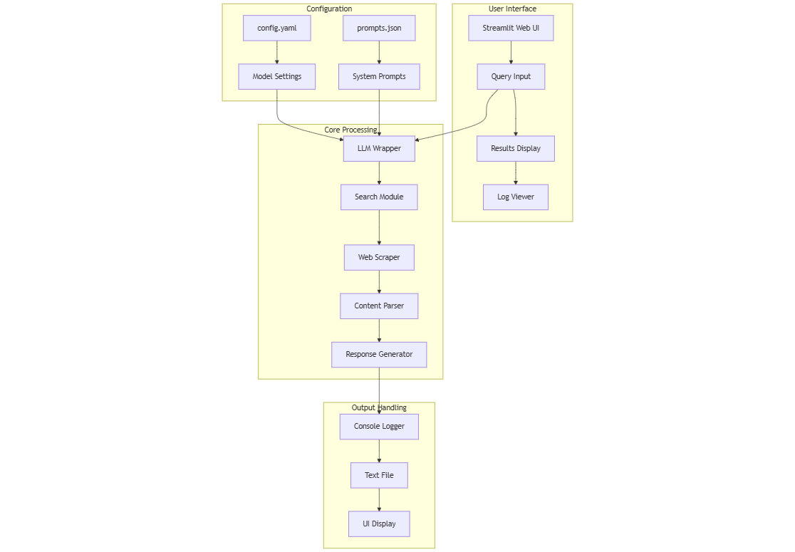

# Real-Time Context-Aware AI Agents :  Searching, Scraping, and Synthesizing for Precision


# How To Build AI Agents To Decompose Tasks &amp; Execute Parallel via Map Reduce

Coz Enterprise Grade, Production AI Agentic System, Is What Ultimately Matters

TL;DR

Built a system where multiple AI agents work together like a team of experts — one generates solutions, another evaluates them, a third does deep analysis, and a fourth ranks them. It’s like having multiple specialists working in parallel to solve complex business problems faster and smarter.

Full Article : [https://medium.com/@learn-simplified/Real-Time-Context-Aware-AI-Agents-Searching-Scraping-and-Synthesizing-for-Precision-0b9a47a38698


## What's This Project About

This article shows you how to build a system where AI agents work together to solve complex problems. Think of it like a assembly line for problem-solving:

- The first agent generates multiple possible solutions
- The second agent evaluates each solution’s feasibility
- The third agent does deep analysis on the implications
- The fourth agent ranks solutions based on all the analysis

What makes this special is that these agents work in parallel — like having multiple experts working simultaneously instead of waiting for each one to finish before the next starts. I’ve built this using a graph-based approach where each node is a specialized AI agent, and they all communicate through a structured pipeline.

## Why Work on It?

In today’s fast-paced business environment, making quick yet well-thought-out decisions is crucial. While this article uses a fictional company as an example, the principles apply to real business challenges. Here’s what you’ll learn:

- How to break down complex problems into smaller, manageable pieces
- Ways to use AI for parallel processing of solutions
- Techniques for combining multiple AI perspectives into coherent recommendations
- Methods for scaling decision-making processes without sacrificing quality

The system I’ve built demonstrates how businesses can:

- Automate complex analysis while maintaining high standards
- Get multiple perspectives on problems simultaneously
- Reduce decision-making time through parallel processing
- Ensure consistent evaluation of solutions
- Scale their problem-solving capabilities

## Architecture


# AI Agents Architecture Flow Explanation

Looking at complex business problem-solving, thought a team of AI agents working in parallel would be more efficient than a single agent. Here's how the architecture flows:

## User Interface Layer
Started with a web interface where users input their problems and key considerations. Made it interactive because business users need a clean, straightforward way to describe their challenges. The interface captures both the core problem and specific factors that need attention.

## State Management 
Built a two-part state management system:
- Overall State: Tracks the entire problem-solving journey
- Solution State: Manages individual solution progress
This split helps track both the big picture and specific details as solutions move through the pipeline.

## AI Agents Processing Pipeline
Structured the processing like an expert consulting team:

### Generation Phase
Created a dedicated agent for generating initial solutions. This agent works like a brainstorming expert, taking the problem and considerations to produce multiple potential approaches. Designed it to generate three distinct solutions to ensure variety in approaches.

### Parallel Evaluation
Set up three evaluation agents running simultaneously because waiting for sequential evaluation wastes time. Each agent thoroughly assesses one solution across multiple dimensions:
- Technical feasibility
- Resource requirements
- Implementation challenges
- Risk factors
- Success metrics

### Deep Analysis
Added another layer of parallel processing with three deep analysis agents. Each one digs into:
- Long-term impacts
- Scalability potential
- Strategic alignment
- Market implications
Having parallel analysis speeds up the process without sacrificing thoroughness.

### Ranking Phase
Wrapped up with a ranking agent that consolidates all the analysis. This agent weighs different factors and produces a prioritized list of solutions with clear justifications. Think of it as the senior partner making final recommendations after reviewing all the detailed work.

## Results & Logging
Created two output streams:
1. Ranked Solutions: Clear, actionable recommendations for the user
2. Session Logs: Detailed records of the entire decision-making process

Added comprehensive logging because understanding how decisions were made becomes crucial when implementing solutions or making adjustments later.

# Key Design Decisions
The parallel processing approach came from realizing that in real consulting teams, different experts can evaluate different aspects simultaneously. Why make AI work sequentially when it can handle multiple streams?

Kept the state management separate from processing to make the system more maintainable and scalable. This way, adding new types of analysis or changing the evaluation criteria doesn't require rebuilding the entire pipeline.

The color coding in the diagram represents different functional areas. Used cool colors for input/output processes and warmer colors for analysis phases to make the flow intuitive for technical teams reviewing the architecture.


# Tutorial: How To Build AI Agents To Decompose Tasks &amp; Execute Parallel via Map Reduce

## Prerequisites
- Python installed on your system.
- A basic understanding of virtual environments and command-line tools.

## Steps

1. **Virtual Environment Setup:**
   - Create a dedicated virtual environment for our project:
   
     ```bash
     python -m venv Real-Time-Context-Aware-AI-Agents-Searching-Scraping-and-Synthesizing-for-Precision
     ```
   - Activate the environment:
   
     - Windows:
       ```bash
       Real-Time-Context-Aware-AI-Agents-Searching-Scraping-and-Synthesizing-for-Precision\Scripts\activate       
       ```
     - Unix/macOS:
       ```bash
       source Real-Time-Context-Aware-AI-Agents-Searching-Scraping-and-Synthesizing-for-Precision/bin/activate
       ```
   
# Installation and Setup Guide

**Install Project Dependencies:**

Follow these steps to set up and run the  "Agents To Decompose Tasks &amp; Execute Parallel via Map Reduce"

1. Navigate to your project directory:
   ```
   cd path/to/your/project
   ```
   This ensures you're in the correct location for the subsequent steps.

2. Install the required dependencies:
   ```
   pip install -r requirements.txt   
   ```
   This command installs all the necessary Python packages listed in the requirements.txt file.


## Run - Hands-On Guide: How To Build AI Agents To Decompose Tasks &amp; Execute Parallel via Map Reduce

   ```bash 
     
      # Run 
      python Web-LLM.py 
      
      /<YOUR_QUERY>   <enter>  CNTR+Z  <enter>      
      
   ```

## Conclusion and Next Steps

Congratulations! You've just Built - AI Agents To Decompose Tasks &amp; Execute Parallel via Map Reduce
